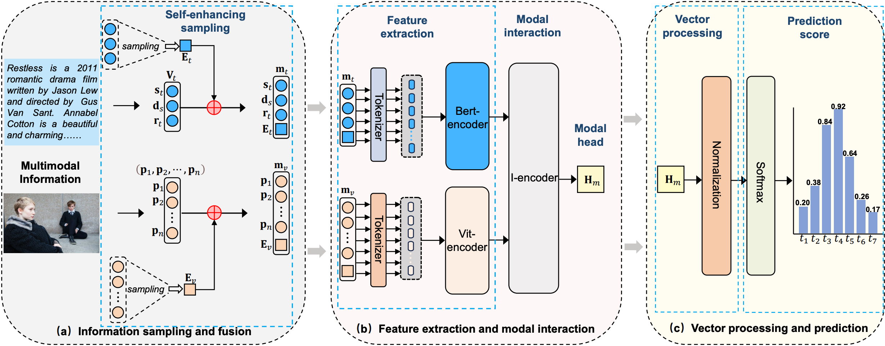

# Adaptive Modality Interaction Transformer for Multimodal Knowledge Graph Completion


## Overview

AdaMKGC was implemented using PyTorch, with a CPU (Intel Xeon Gold6330) and a GPU (RTX3090). AdaMKGC consists of three modules：

- Information Sampling and Fusion
- Feature Extraction and Modal Interaction
- Vector Processing and Prediction

<p align="center">
   
</p>

### 1. Prerequisites

Python==3.8,

Pytorch==1.11.0,

transformers==4.11.3,

torchvision==0.8.2,

scikit-learn==1.0,

numpy>=1.21,

tokenizers==0.10.3,

torchmetrics==0.7.3


### 2. Download data

- We use WN18-IMG, FB15k-237-IMG, and WN18RR++ datasets for multimodal knowledge graph completion.
- You can download the WN18-IMG, FB15k-237-IMG dataset from [Google Drive] (https://drive.google.com/drive/folders/1FRc-649hm1DhjODlVlFUSAE1UDZKq4Ct?usp=sharing)

### 3. Data Processer

```
python data processer/processor.py
```

### 4. Training

```
python main.py
```
